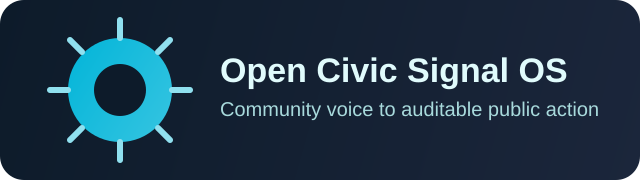

<p align="center">
  
</p>

# Open Civic Signal OS

Monorepo civic-tech platform that converts community signals into transparent public priorities.

## Why this product exists

Open Civic Signal OS helps communities turn repeated local problems into a public backlog that people can understand, trust, and act on.

For a citizen, the promise is simple:

1. Report a real local problem in plain language.
2. See why it was prioritized.
3. Follow what changed, who responded, and what is still pending.

For public servants and community leaders, the product should reduce noise, surface what matters first, and keep evidence visible.

## What users should understand in the first minute

- What the product helps solve.
- What the main action is right now.
- What happens after a report is submitted.
- Why some issues rank higher than others.
- Where to return to track progress.

Current UX gap: the repo and app explain the technical platform well, but they still expose too many navigation and workflow choices too early for first-time users. Ongoing frontend work is focused on simplifying first-run experience, clarifying primary actions, and reducing cognitive load.

## Core user journeys

### Community member

- Report a problem.
- Support an existing issue instead of duplicating it.
- Understand why a problem is high priority.
- Track updates from the community or institution.

### Community moderator or coordinator

- Review community conversations.
- Publish progress updates with clear role boundaries.
- Keep discussion channels usable and auditable.

### Public servant

- Identify highest-priority problems fast.
- Publish progress updates.
- Use transparent evidence to justify action ordering.

## Official Stack

- Backend: Java 21 + Spring Boot
- Frontend: React + TypeScript + Vite
- Data: PostgreSQL (planned), JSON-first MVP now
- Contracts: OpenAPI in `packages/contracts`

## Monorepo Layout

- `apps/api-java`: Spring Boot API and prioritization services
- `apps/web-react`: public dashboard and operator console
- `packages/contracts`: API contracts and shared schemas
- `infra`: local environment and deployment assets
- `docs`: strategy, ideas, architecture, and execution plans

## Quick start

### Canonical integrated dev runtime

Use Docker for the full app. This is the required hot-reload path for frontend + backend together:

```bash
npm run docker:dev:up
```

Helpful runtime commands:

```bash
npm run docker:dev:doctor
npm run docker:dev:ps
npm run docker:dev:logs
npm run docker:dev:down
```

If Docker is unavailable, treat that as a local environment blocker. Do not silently switch to ad-hoc non-Docker app startup when validating integrated behavior.

### Current MVP scripts

```bash
npm install
npm run prioritize
```

### Component-only fallback commands

```bash
cd apps/web-react
npm install
npm run dev
```

### Java API

```bash
cd apps/api-java
./mvnw spring-boot:run
```

These direct commands are for isolated component work only. Agent-driven app validation should still use `npm run docker:dev:up`.

## Launch resources

- Demo GIF: `assets/demo.gif`
- Architecture GIF: `assets/architecture.gif`\n- Architecture SVG: `assets/stack-map.svg`
- Landing: `docs/index.html`
- Execution ideas: `docs/ideas.md`
- Agent playbook: `AGENTS.md`

## Roadmap issues

- https://github.com/jdsalasca/open-civic-signal-os/issues

## Vision

Community voice should become visible, measurable, and actionable.

## Visual Assets

- Brand kit: `assets/brand-kit.md`
- Mark: `assets/logo-mark.svg`
- Wordmark: `assets/logo-wordmark.svg`
- Banner SVG: `assets/banner.svg`
- Social card PNG: `assets/social-card.png`
- Logo PNG: `assets/logo-512.png`

## Docker Quickstart

- Dev (hot reload): `npm run docker:dev:up`
- Dev doctor: `npm run docker:dev:doctor`
- Dev logs: `npm run docker:dev:logs`
- Prod-like: `npm run docker:prod:up`
- Stop: `npm run docker:dev:down`

See full guide: `docs/DOCKER_CLAUDE.md` and `CLAUDE.md`.

## Product direction

Current product work is centered on:

- simpler first-screen hierarchy
- clearer primary calls to action
- lower-friction onboarding and verification
- accessible keyboard/mobile navigation
- trust surfaces that explain ranking and progress without jargon

## GHCR Quickstart

- Use prebuilt images: `npm run docker:ghcr:up`
- Stop GHCR deployment: `npm run docker:ghcr:down`
- CI image workflow: `.github/workflows/docker-images.yml`
