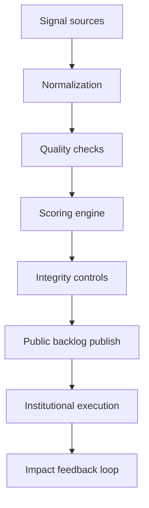
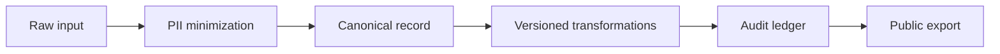
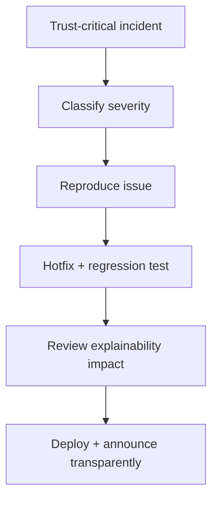
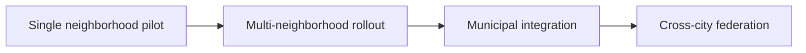

# Advanced Diagrams

## Civic Ranking Lifecycle

```mermaid
flowchart TD
  A[Signal sources] --> B[Normalization]
  B --> C[Quality checks]
  C --> D[Scoring engine]
  D --> E[Integrity controls]
  E --> F[Public backlog publish]
  F --> G[Institutional execution]
  G --> H[Impact feedback loop]
```

## Data Governance Flow

```mermaid
flowchart LR
  A[Raw input] --> B[PII minimization]
  B --> C[Canonical record]
  C --> D[Versioned transformations]
  D --> E[Audit ledger]
  E --> F[Public export]
```

## Incident Response Workflow

```mermaid
flowchart TD
  A[Trust-critical incident] --> B[Classify severity]
  B --> C[Reproduce issue]
  C --> D[Hotfix + regression test]
  D --> E[Review explainability impact]
  E --> F[Deploy + announce transparently]
```

## Pilot Expansion Map

```mermaid
flowchart LR
  A[Single neighborhood pilot] --> B[Multi-neighborhood rollout]
  B --> C[Municipal integration]
  C --> D[Cross-city federation]
```
