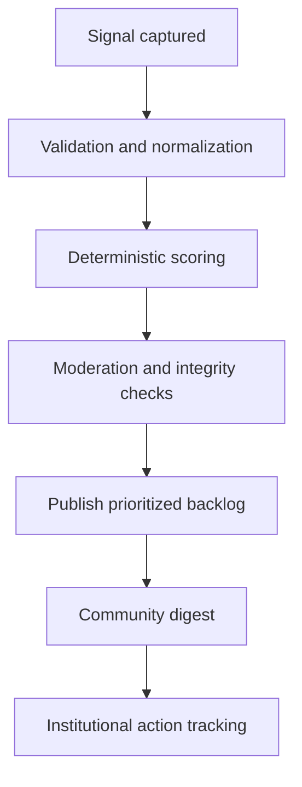
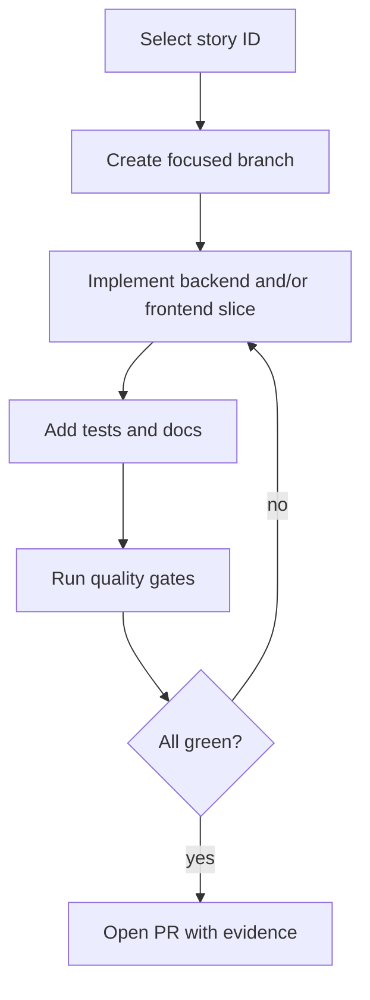
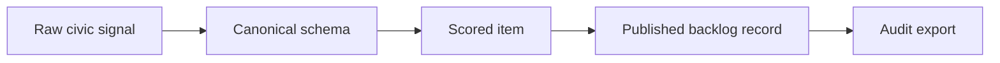

# Process Flows

## Idea to Public Impact

```mermaid
flowchart TD
  A[Signal captured] --> B[Validation and normalization]
  B --> C[Deterministic scoring]
  C --> D[Moderation and integrity checks]
  D --> E[Publish prioritized backlog]
  E --> F[Community digest]
  F --> G[Institutional action tracking]
```

## PR Delivery Flow

```mermaid
flowchart TD
  A[Select story ID] --> B[Create focused branch]
  B --> C[Implement backend and/or frontend slice]
  C --> D[Add tests and docs]
  D --> E[Run quality gates]
  E --> F{All green?}
  F -- no --> C
  F -- yes --> G[Open PR with evidence]
```

## Trust and Audit Flow

```mermaid
flowchart LR
  A[Raw civic signal] --> B[Canonical schema]
  B --> C[Scored item]
  C --> D[Published backlog record]
  D --> E[Audit export]
```
