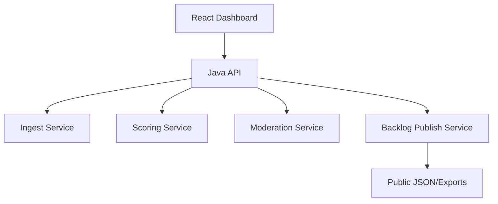

# System Design

## Architecture

## Contract Boundaries

- Backend owns canonical ranking logic.
- Frontend only renders ranking and explanations.
- OpenAPI is source of truth for all external consumers.
- Audit metadata must persist end-to-end.

## Non-Functional Targets

- Deterministic ranking across reruns.
- Explainable output for every ranked item.
- Low-bandwidth friendly dashboard rendering.
- PII minimization at ingest.
